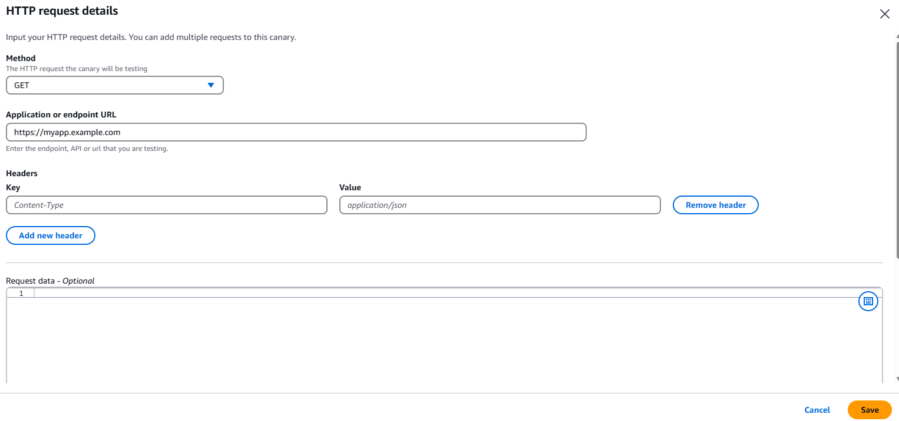
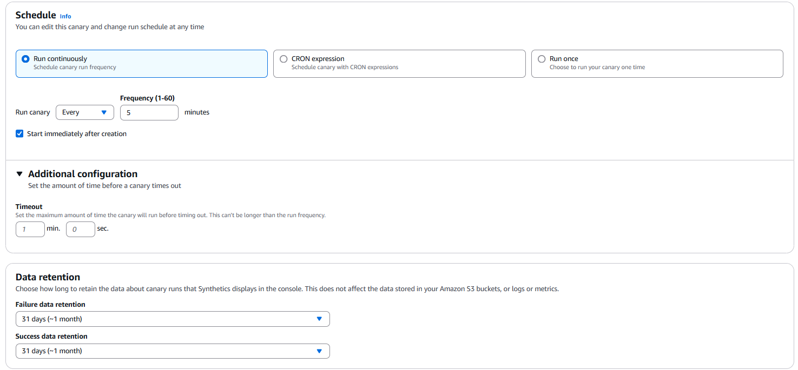
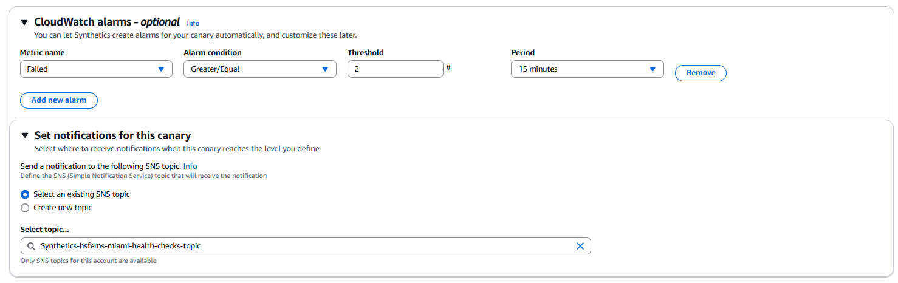
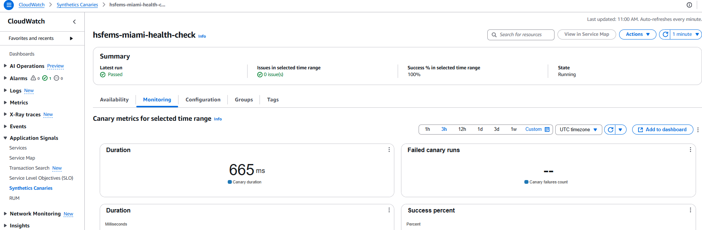

# AWS CloudWatch Synthetics Canary Setup Guide

## 📌 Introduction
This guide provides step-by-step instructions to set up an AWS CloudWatch Synthetics Canary to monitor a web application and ensure it always returns **HTTP 200 OK**.

---

## 📋 Prerequisites
Before starting, make sure you have:
- **An AWS account** with access to CloudWatch and IAM permissions to create a Canary.
- **A web application URL** to monitor (e.g., `https://myapp.example.com`).
- (Optional) **SNS Topic** configured for notifications.

---

## 🛠 Step 1: Access AWS CloudWatch Synthetics
1. Log in to your **AWS Management Console**.
2. Navigate to **CloudWatch**.
3. On the left panel, click on **Application Signals > Synthetics Canaries**.
4. Click **Create Canary**.

📌 *Screenshot Example:*

---

## 🚀 Step 2: Create a Canary
1. **Choose 'Use a Blueprint'**: Select **API Canary**.
2. **Canary Name**: Choose a meaningful name (e.g., `web-health-check`).
3. **Enter URL**: Click on **Add HTTP Request**, Choose **GET Method** and Provide the application URL (e.g., `https://myapp.example.com`).

📌 *Screenshot Example:*

---

## ⏳ Step 3: Set Execution Schedule
1. Under **Schedule**, set the Canary to run every **5 minutes**.
2. **Set Timeout**: Under **Additional configuration** Choose Timeout for `15 seconds` (adjust if necessary).
2. Enable **Data Retention**, set it to **31 days**.

📌 *Screenshot Example:*

---

## 📢 Step 4: Configure Alerts
1. **Enable CloudWatch Alarms**.
2. Create an alarm that triggers if the Canary fails **3 times in a row**.
3. Connect it to an **SNS Topic** for email/SMS notifications.

📌 *Screenshot Example:*

---

## ✅ Step 5: Create and Run the Canary
1. Click **Create Canary**.
2. Wait a few minutes for the Canary to start running.
3. Check the **Results Dashboard** under `CloudWatch > Synthetics > Canaries`.

---

## 🔍 Step 6: Monitor and Troubleshoot
- View **Success/Failure Metrics** in CloudWatch.
- Check **Logs** under `CloudWatch Logs` if errors occur.
- (Optional) Add additional Canaries to test different endpoints.

📌 *Screenshot Example:*

---

## 🎯 Summary
By following these steps, you now have a fully operational **CloudWatch Synthetics Canary** that continuously monitors your web application's availability and sends alerts on failures.

🔹 Need to extend monitoring? Add **Latency Checks** or create multiple canaries for different endpoints!

🚀 **Happy Monitoring!** 🚀

